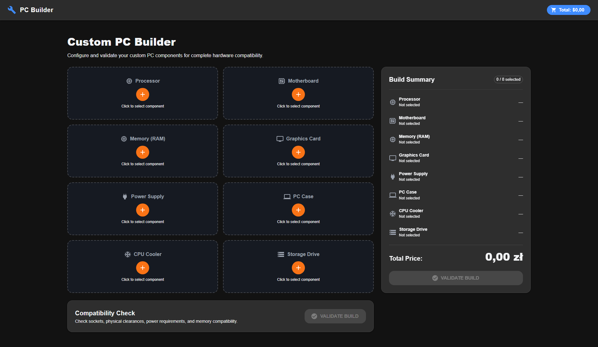
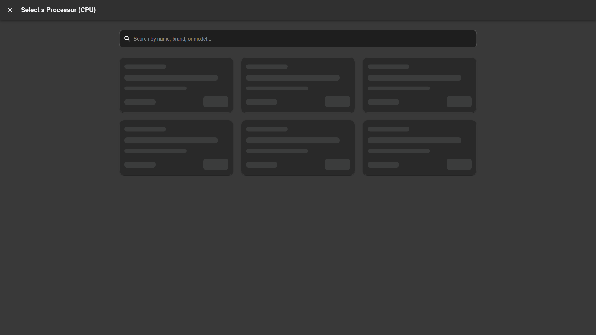

# PC Builder

A full-stack web application designed to help users build custom PCs. The platform fetches real hardware data (prices, specifications) and features an advanced compatibility engine that verifies whether selected components work together physically and electronically.

## Core Features

* **Advanced Compatibility Engine**: Validates CPU sockets, motherboard form factors, RAM capacity/speed, PSU wattage, GPU physical clearance, and detects potential bottlenecks (e.g., PCIe generation mismatches or required BIOS updates).
- **Automated Web Scraping**: Live components pricing and specifications parsed directly from major retailers using asynchronous Playwright instances.
- **Dynamic Frontend**: Modern UI built with React, Material-UI (MUI), and Zustand for state management.
- **Share & Export**: Share your custom builds easily with generated URLs, or export them to a professional PDF summary.
- **Estimated Power Draw**: Real-time wattage calculator for the selected components.
- **Dockerized Architecture**: Simplified deployment and orchestration with Docker Compose.

## Screenshots

<details>
  <summary>Click to view screenshots</summary>
  
  **Main PC Builder View**  
  
  
  **Component Selection**  
  
  
  **Compatibility Engine in Action**  
  
</details>

## Tech Stack

* **Frontend**: React 18, TypeScript, Vite, Material-UI (MUI v6), Zustand
* **Backend**: Python 3.11, FastAPI, SQLAlchemy 2.0, Pydantic, Playwright
* **Database**: PostgreSQL 16
* **Infrastructure**: Docker & Docker Compose

## Project Structure

```text
├── backend/          # FastAPI application, SQLAlchemy models, and Playwright scrapers
├── frontend/         # React SPA built with Vite
└── docker-compose.yml
```

## Quick Start (Docker)

The easiest way to run the application is using Docker.

1. **Clone the repository:**
   ```bash
   git clone https://github.com/Kkacper04/PC_BUILDING.git
   cd PC_BUILDING
   ```

2. **Configure environment variables:**
   Ensure you have a `.env` file inside the `backend/` directory containing the database credentials and scraping URLs.

3. **Start the containers:**
   ```bash
   docker-compose up --build -d
   ```

4. **Access the application:**
   * Frontend: `http://localhost:5173`
   * Backend API Docs (Swagger): `http://localhost:8000/docs`
   * Database: `localhost:5432`

## Local Development (Without Docker)

If you prefer running services directly on your host machine:

**Backend:**
```bash
cd backend
python -m venv venv
source venv/bin/activate  # Or `venv\Scripts\activate` on Windows
pip install -r requirements.txt
playwright install chromium
uvicorn app.main:app --reload
```

**Frontend:**
```bash
cd frontend
npm install
npm run dev
```

## License
MIT
